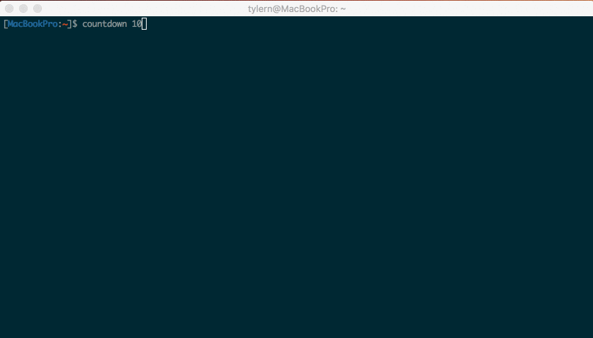

#The Final Countdown

A simple C++ program to give a colored countdown in the command line.

I built this because I often want to wait for one command to finish before running a new command in
another window (when I didn't think ahead and just && it in the first place).

##Build
Building is simple 
* `make`

To wait 5 seconds:
* `./countdown 5` 

##Use
How I usually use the command:
* `countdown 5 && next_command_I_want`

I've also moved the script into my path by:

* `sudo cp countdown /usr/local/bin/`
